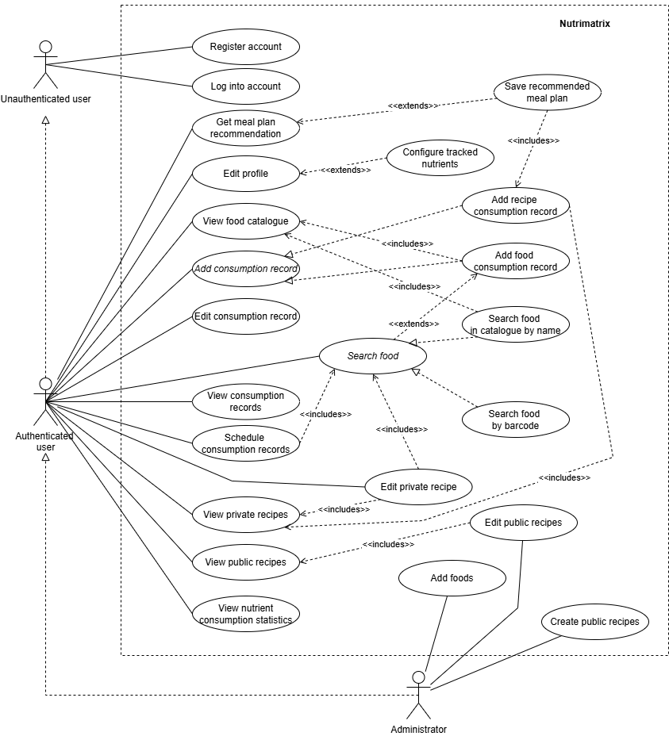
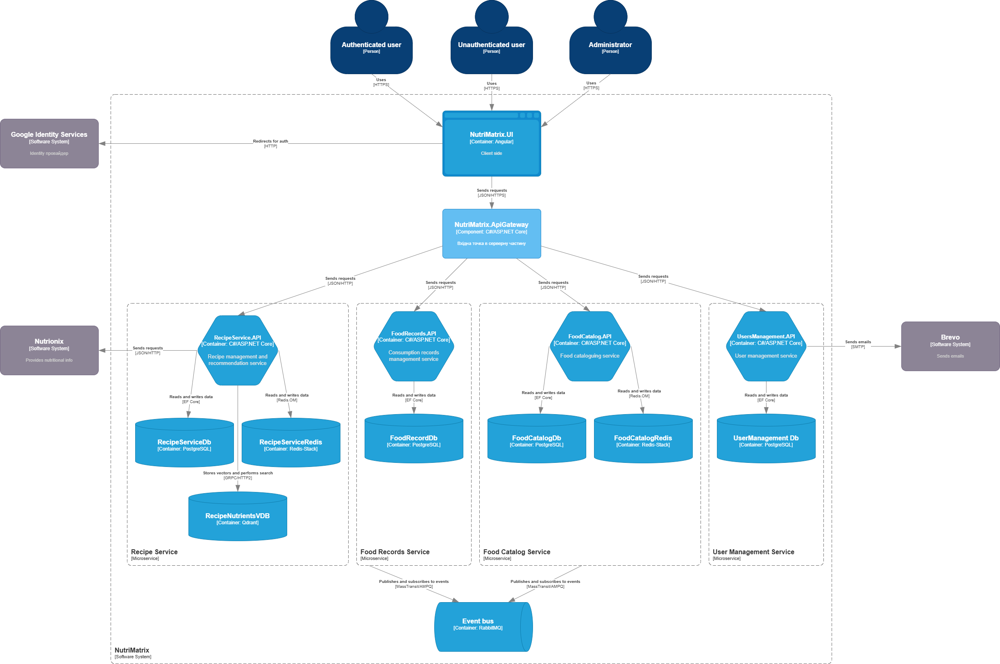
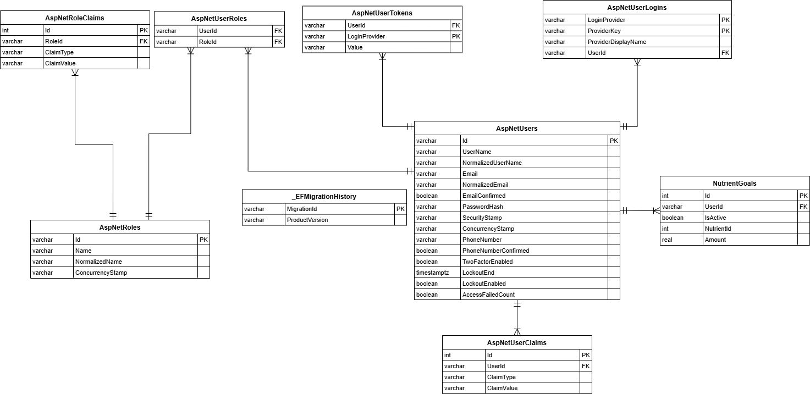
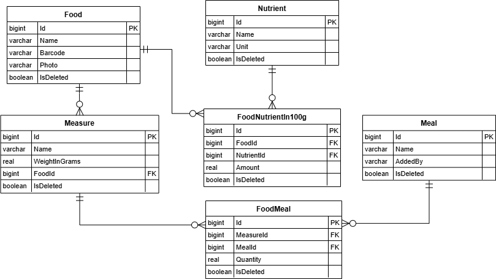
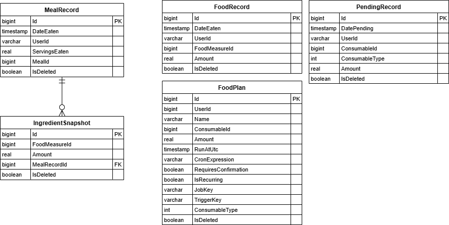
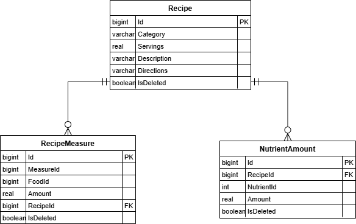

# 🥗 NutriMatrix


NutriMatrix is a distributed microservices-based system designed to automate nutritional analysis and personalized meal planning. The system features a recommendation engine driven by a **Genetic Algorithm** combined with **Vector Similarity Search**.


## Features

The application provides following functionality:

* **User Management:** Secure registration, email confirmation, and profile settings (nutritional goals, TDEE, BMR, etc.).
* **Food Catalog:** Search products by name or scan via **Barcode**.
* **Smart Diary:** Log consumption of products and complex recipes; schedule future meals.
* **Recipe Hub:**
    * **Public Recipes:** Browsable catalog for all users.
    * **Private Recipes:** Users can create custom recipes with auto-calculated nutrition.
* **Smart Meal Planner:**
    * Generates daily rations using a **Genetic Algorithm**.
    * Filters recipes using **Vector Similarity Search (Cosine Distance)**.
* **Analytics:** Visual statistics of nutrient consumption over time.

**Use Case Diagram:**



## Tech Stack 

### **Backend (Microservices)**
* **Framework:** ASP.NET Core Web API (.NET 8).
* **Communication:**
    * **Synchronous:** HTTP/REST (Gateway to Client).
    * **Asynchronous:** **RabbitMQ** (via MassTransit) for inter-service events.
* **Data Storage:**
    * **PostgreSQL:** Relational data (Users, Diary, Products).
    * **Redis:** High-speed caching (via Redis.OM).
    * **Qdrant:** Vector database for recipe embeddings and similarity search.
* **Background Jobs:** **Quartz.NET** for scheduled tasks.
* **Patterns:** CQRS and Mediator (via MediatR), Generic Repository, Specification (Ardalis), Outbox Pattern.

### **Frontend**
* **Framework:** Angular.
* **Styling:** Tailwind.
* **State Management:** RxJS 
### **DevOps & Infrastructure**
* **Containerization:** Docker & Docker Compose.
* **Gateway:** YARP as the entry point.

## System Architecture and Algorithmic design

### 1. High-Level Overview
The system is divided into independent services, each with its own database, communicating asynchronously via an Event Bus.
* **Client:** Angular SPA.
* **Gateway:** Single entry point routing requests to microservices.
* **Services:** Identity, Catalog, Diary, Recommendation (Genetic Algo).

To ensure maintainability and testability, every individual microservice follows strict architectural guidelines:

* **Onion Architecture:** The code is organized into concentric layers (Domain, Application, Persistance, API). Dependencies flow inwards, ensuring the Core Domain logic remains independent of external frameworks or databases.
* **CQRS:** Commands and Queries are handled by separate pipelines to allow for independent scaling of read/write loads and optimized data models for each scenario.

### C4 Diagrams

<details>
<summary><b>Click to view Context Level</b></summary>


</details>

<details>
<summary><b>Click to view Container Level</b></summary>


</details>


### 2. Logic Flow (Recommendation Engine)
1.  **Vector Search:** The system converts user preferences into a vector and queries **Qdrant** to find "nearest neighbor" recipes (Cosine Similarity).
2.  **Genetic Algorithm:** The engine takes these candidates and evolves a population of meal plans to minimize the error between the plan's total nutrients and the user's goals.

### Database Schemas:
<details>
<summary><b>Click to view User Management service database scheme</b></summary>


</details>
<details>
<summary><b>Click to view Food Catalogue service database scheme</b></summary>


</details>

<details>
<summary><b>Click to view Food Records service database scheme</b></summary>


</details>

<details>
<summary><b>Click to view Food Records service database scheme</b></summary>


</details>

## Getting Started (Docker)

The entire system (Databases, RabbitMQ, API Services, and Frontend) is containerized. You can launch the full environment with a single command.

### Prerequisites
* [Docker](https://www.docker.com/products/docker-desktop) installed.
* [Docker Compose](https://docs.docker.com/compose/install/) installed.

### Installation Steps

1.  **Clone the repository:**
    ```bash
    git clone https://github.com/Khilchuk-Artem/NutriMatrix.git
    cd NutriMatrix
    ```

2.  **Set up Environment Variables:**
    ```bash
    # Example .env configuration
    POSTGRES_PASSWORD=your_password
    RABBITMQ_USER=guest
    RABBITMQ_PASS=guest
    ```

3.  **Build and Run:**
    ```bash
    docker-compose up -d --build
    ```

4.  **Access the Application:**

    | Service | URL | Description |
    | :--- | :--- | :--- |
    | **Frontend UI** | `http://localhost:4200` | Angular Application |
    | **Auth API** | `http://localhost:5000` | Identity Service |
    | **Catalog API** | `http://localhost:5001` | Food Search & Barcode |
    | **Diary API** | `http://localhost:5002` | Food Records & History |
    | **Planner API** | `http://localhost:5003` | Recommendation Engine |
    | **RabbitMQ** | `http://localhost:15672` | Management Dashboard (u: guest/guest) |
    | **Qdrant** | `http://localhost:6333` | Vector DB Dashboard |
    | **Redis UI** | `http://localhost:8001` | Redis Insight/Stack |

### Troubleshooting
If containers fail to start, check the logs:
```bash
docker-compose logs -f